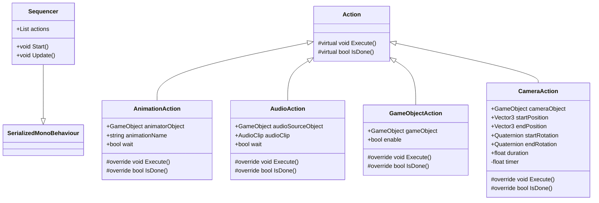

# sequencing system
 
A sequencing system refers to a mechanism or framework that allows for the orchestration and control of a series of actions or events in a specific order. It provides a way to define and manage the flow of actions or events.
 
Create a sequencing system that allows for the dynamic control of objects, audio playback, and material changes within a small interactive scene. This task will test your ability to design and implement a flexible system, utilizing scripting and Unity's features effectively.
 
The sequencing system should support the following actions:
- Run animations in the Unity Animator with the ability to wait for the animation to finish before proceeding to the next action.
- Play audio clips with the ability to wait for the audio to finish before proceeding to the next action.
- Waiting before an audio or animation is finished should be optional. (It can be disabled for the given action)
- Enable or disable game objects.
- Smoothly move cameras cinematically from point A to point B.

# Requriment

unity 2021.3.18f1 or later.

[Odin Inspector and Serializer](https://assetstore.unity.com/packages/tools/utilities/odin-inspector-and-serializer-89041)

# Example

The final result should look like this

# classDiagram

